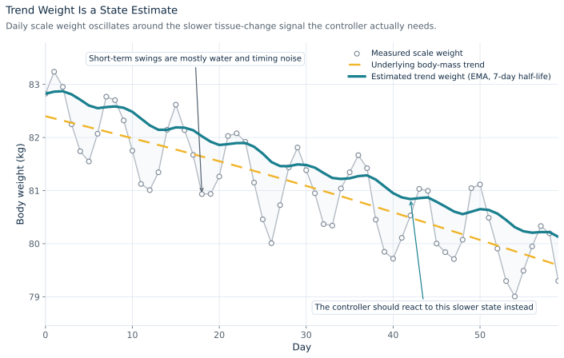
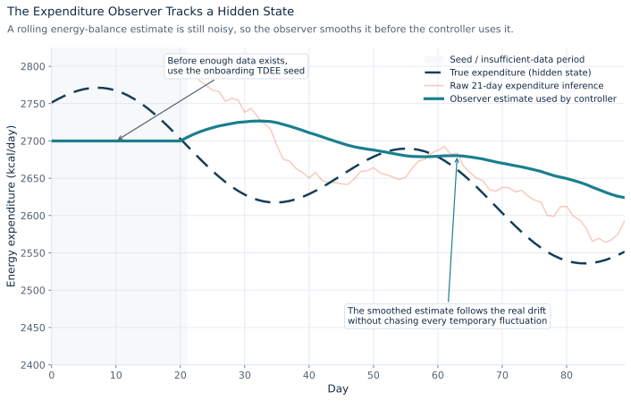
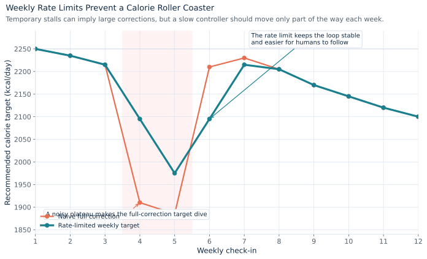
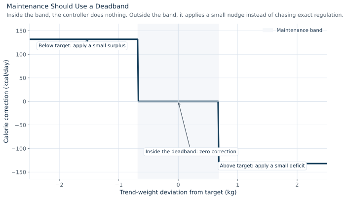

# Adaptive Calorie Targets as a Control Problem

This note explains the adaptive calorie-target problem from a control theory perspective.

The short version is:

- the body is the plant
- calorie targets are the control input
- scale weight is a noisy measurement
- energy expenditure is a hidden, time-varying state
- the right architecture is an observer-based adaptive controller with slow weekly updates

All figures in this note use synthetic data generated by [generate_adaptive_calorie_plots.py](./generate_adaptive_calorie_plots.py).

## 1. Problem Statement

The app wants to choose a calorie target that moves body weight toward a desired goal:

- lose weight at a controlled rate
- maintain weight inside a narrow band
- gain weight at a controlled rate

At first glance, this looks simple: if weight is too high, lower calories; if weight is too low, raise calories.

That naive approach fails because scale weight is not the state we actually care about. Daily weight is heavily corrupted by noise from:

- water retention
- glycogen changes
- sodium intake
- bowel contents
- menstrual cycle effects
- inconsistent weigh-in timing

The real control problem is therefore not direct regulation of raw scale weight. It is regulation of a hidden energy-balance system under noisy measurements and uncertain inputs.

## 2. Variables

Use a discrete-time model with one-day sampling.

Let:

- $w_k$ be trend body weight in kilograms
- $\tilde{w}_k$ be measured scale weight
- $I_k$ be actual daily calorie intake
- $u_k$ be recommended calorie target
- $E_k$ be true daily energy expenditure
- $r_k$ be the desired weight trajectory or target rate

The controller does not directly command the body. It only publishes a recommended target $u_k$. The user then follows it imperfectly, so in practice:

$$
I_k = u_k + a_k
$$

where $a_k$ is adherence error.

## 3. Plant Model

At a coarse level, body mass evolves according to energy balance:

$$
w_{k+1} = w_k + \frac{I_k - E_k}{\rho} + d_k
$$

where:

- $\rho \approx 7700 \ \text{kcal/kg}$ is the energy equivalent of one kilogram of body mass
- $d_k$ is lumped disturbance and modeling error

This is not a perfect physiological model. It is a control-oriented approximation.

Energy expenditure is not constant. It changes over time with body mass, activity, fatigue, training, adaptation, and routine changes. So model it as a slowly varying hidden state:

$$
E_{k+1} = E_k + q_k
$$

where $q_k$ is a small process disturbance.

The measurement equation is:

$$
\tilde{w}_k = w_k + v_k
$$

where $v_k$ is measurement noise.

This gives a simple state-space interpretation:

$$
x_k =
\begin{bmatrix}
w_k \\
E_k
\end{bmatrix}
$$

with measured output $\tilde{w}_k$ and partially observed input $I_k$.

## 4. Why This Is Hard

There are four control difficulties:

### 4.1 Measurement noise is large

The measured scale weight $\tilde{w}_k$ is much noisier than the slow trend we care about.

### 4.2 The plant is slow

Changes in calorie intake produce gradual changes in trend weight. This introduces effective delay and makes aggressive control unstable.

### 4.3 The actuator is a human

The app outputs a recommended calorie target $u_k$, but the actual intake $I_k$ may differ significantly. This means the loop is only partially actuated.

### 4.4 A key state is hidden

Expenditure $E_k$ is not directly measured. It must be estimated from intake and weight dynamics.

## 5. Why a Naive PID Is the Wrong Tool

A direct PID on raw scale weight would look something like:

$$
u_k = K_P e_k + K_I \sum_{i=0}^k e_i + K_D(e_k - e_{k-1})
$$

with:

$$
e_k = w_k^{\ast} - \tilde{w}_k
$$

This is a poor fit for the problem.

### 5.1 Derivative action amplifies noise

The derivative term reacts strongly to day-to-day scale noise, which is mostly water and measurement variability rather than tissue change.

### 5.2 Integral action winds up

If weight stalls for a week due to water retention, integral action would accumulate false error and push targets too aggressively.

### 5.3 The system has delay and uncertain actuation

Classic PID works best when the plant is directly actuated and measured output reflects the controlled state quickly enough. Neither assumption holds here.

For this problem, the better approach is not "weight error to calories" directly. The better approach is:

1. estimate the hidden state
2. infer the current expenditure
3. compute the intake that should produce the desired rate
4. apply that change gradually

## 6. Observer-Based Architecture

The right architecture is a two-layer system:

1. an observer
2. a low-bandwidth controller

## 6.1 Observer

The observer converts noisy measurements into useful state estimates.

It should estimate:

- trend weight $\hat{w}_k$
- expenditure $\hat{E}_k$
- confidence / status of the estimate

### Trend-weight estimator

A simple exponential moving average is enough for the first implementation:

$$
\hat{w}_k = \alpha \tilde{w}_k + (1-\alpha)\hat{w}_{k-1}
$$

where $\alpha$ is chosen from a multi-day half-life.

This removes most short-term noise while preserving slower movement in body mass.



The measured scale weight wanders widely, but the estimated trend remains close to the slower underlying signal. This is why the controller should not react to raw day-to-day weight alone.

### Expenditure estimator

Using the energy balance equation:

$$
E_k \approx I_k - \rho (w_{k+1}-w_k)
$$

In practice, use trend weight and a rolling window:

$$
\hat{E}_k^{\text{raw}} =
\overline{I}_{k-L+1:k}
- \rho \frac{\hat{w}_k - \hat{w}_{k-L}}{L}
$$

where:

- $L$ is the lookback window in days
- $\overline{I}_{k-L+1:k}$ is the average intake over valid days

Then smooth that raw estimate:

$$
\hat{E}_k = \beta \hat{E}_k^{\text{raw}} + (1-\beta)\hat{E}_{k-1}
$$

This is a simple observer for a slowly varying hidden state.



The raw expenditure inference can still bounce around because it is built from noisy measurements. The observer smooths that inference into a slower state estimate that is safe for the controller to use.

## 6.2 Controller

Once $\hat{E}_k$ is available, the controller can compute the calorie target required for a desired rate of change.

Suppose the desired change in body weight is $\Delta w_k^\ast$ kilograms per week. Then the desired daily energy imbalance is:

$$
b_k^\ast = \rho \frac{\Delta w_k^\ast}{7}
$$

For weight loss:

$$
b_k^\ast < 0
$$

For weight gain:

$$
b_k^\ast > 0
$$

Then the nominal calorie target is:

$$
u_k^\ast = \hat{E}_k + b_k^\ast
$$

This is model inversion: estimate current expenditure, then back out the intake required to achieve the desired energy balance.

## 7. Why Weekly Updates Are Correct

The system should not update calorie targets every day.

Daily updates would:

- chase noise
- produce oscillation
- reduce user trust
- create unnecessary target churn

A weekly update interval is a good control choice because the plant is slow and the observer needs time to absorb new information.

So the controller is intentionally low bandwidth.

Instead of updating $u_k$ each day, compute a weekly recommendation:

$$
u_{n+1}^{\text{prop}} = \hat{E}_n + b_n^\ast
$$

where $n$ is the check-in index, not the day index.

## 8. Smoothing as a Stability Device

Even after estimating expenditure, the controller should not apply the full recommended jump immediately.

Let:

$$
\Delta u_n = u_{n+1}^{\text{prop}} - u_n
$$

Then apply a slew-rate limit:

$$
u_{n+1} = u_n + \mathrm{clip}(\Delta u_n, -\Delta_{\max}, \Delta_{\max})
$$

where $\Delta_{\max}$ is a weekly maximum change, for example 75 to 150 kcal/week depending on confidence.

This has several benefits:

- reduces oscillation
- prevents overreaction to temporary stalls
- makes the controller robust to observer error
- keeps recommendations psychologically usable

This is a very practical stability mechanism.



The plot shows the key controller design choice: even if the proposed correction briefly becomes very aggressive, the published target should only move part of the way there. That rate limit is what prevents the classic calorie roller coaster.

## 9. Maintenance as Deadband Control

Maintenance should not try to regulate to an exact weight every day.

Instead, use a deadband around the maintenance target:

$$
| \hat{w}_k - w^\ast | \leq \delta
$$

If the trend weight lies inside the band, apply zero correction:

$$
b_k^\ast = 0
$$

If the trend weight drifts above the band, apply a small deficit. If it drifts below the band, apply a small surplus.

This is standard deadband control. It prevents chattering and avoids needless target changes when the system is already "close enough."



Maintenance is therefore not exact setpoint tracking. It is banded regulation: do nothing inside the acceptable range, and apply only a small correction outside it.

## 10. Confidence-Gated Control

The controller should not trust all observations equally.

If nutrition logging is incomplete or weigh-ins are sparse, the observer quality drops. In that regime, the controller should move into a `holding` mode or reduce its gain.

This can be formalized by letting the maximum weekly change depend on confidence $c_n \in [0,1]$:

$$
\Delta_{\max}(c_n) = \Delta_{\min} + c_n(\Delta_{\max}^{\text{hi}} - \Delta_{\min})
$$

Low confidence means:

- smaller target changes
- or no target changes at all

This is effectively a gain-scheduled controller.

## 11. Final Interpretation

From a control theory perspective, the proposed system is:

- a discrete-time system
- with noisy output measurements
- a slowly varying hidden state
- uncertain actuation due to human adherence
- observer-based state estimation
- model-based target computation
- deadband logic for maintenance
- gain scheduling from confidence
- slew-rate-limited weekly control updates

That is why the best description is:

$$
\text{observer-based adaptive control with deadband and rate-limited weekly updates}
$$

It is not a raw PID. It is closer to a lightweight model-based controller with a simple observer.

## 12. Practical Consequence for OpenNutriTracker

The implementation strategy follows directly from the theory:

1. build weight history
2. estimate trend weight
3. classify logging quality
4. estimate expenditure as a hidden state
5. compute weekly calorie targets from the estimated state
6. limit weekly adjustments
7. expose confidence and `holding` behavior in the UI

That is the control-theoretic rationale behind the adaptive-calorie-engine plan.

## Reproducing the Figures

From the repo root:

```bash
python docs/generate_adaptive_calorie_plots.py
```

This writes SVG figures into `docs/figures/`.
